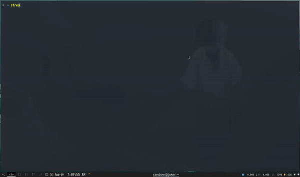

# streamo

A Simple Bash Script to Stream/Download TV-Series and Movies. 🥷🏽

# Preview

# Dependencies

1. curl
2. mpv
3. jq
4. fzf

# Installation

### Basic
		sudo cp streamo /usr/bin/

### Without Cloning
		sudo curl -s "https://raw.githubusercontent.com/Sidmaz666/streamo/main/streamo" -O > /usr/bin/streamo

# Usage
		streamo ["search-query"]

		Example:
		streamo "mr robot" , streamo mr robot

## Misc

1. The script scrapes from <a href="https://fmoviesf.me">Fmovies</a>.
2. Download Directory : <b>$HOME/Video/Streamo</b>
3. Use <i>Rofi</i> instead, change the <b>MENU</b> Variable.
		
		MENU="rofi -show -dmenu -theme gruvbox-dark -i"
	
4. Example Rofi Wrapper Script (Useful when using <b>streamo</b> with a keybinding).
		
		#!/bin/bash
		QUERY="$(rofi -show -dmenu -p "Search " -theme dmenu)"
		[[ -z "$QUERY" ]] && exit
		/usr/bin/streamo $QUERY

### Note

There are no flags associated with the script even the <i>-h</i> or <i>--help</i> flags are not available.
